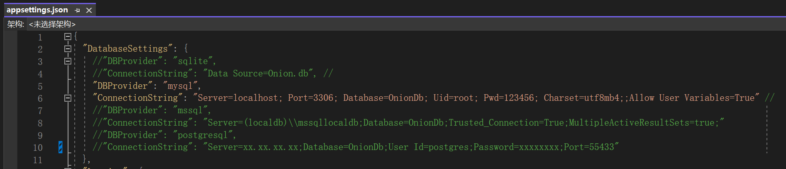
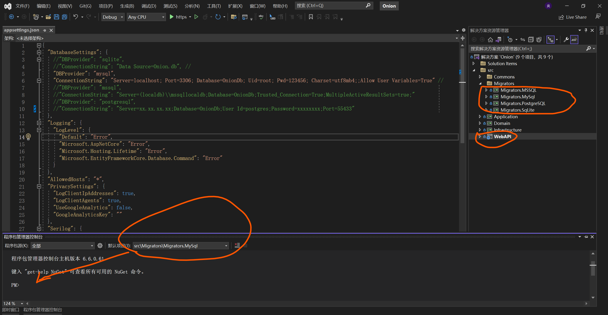

# Onion

#### 介绍

# 欢迎来到洋葱架构+CQRS 后台权限管理系统

当创造力和技术相交汇，一座通往便捷、灵活和可定制化的软件世界敞开大门。

欢迎来到**洋葱架构+CQRS 后台权限管理系统**，不仅是软件，更是你的技术搭档，开启前所未有的开发之旅。

## 穿越洋葱层

我们采用洋葱架构，层层包裹，内核层承载着精华的业务逻辑，分层明确，可维护性和可测试性无可匹敌。

## CQRS 架构

融合 CQRS（命令查询职责分离）模式，命令与查询分离，数据更新与查询操作清晰高效。

## 自动生成神奇

提供控制器信息，系统自动生成菜单、页面、权限点，轻松开发。更令人兴奋的是，根据实体类，一键生成前后端增删改查功能，开发轻松愉快。

## 数据库无忧

支持多种主流数据库，选择适合项目的数据库引擎，无需担心兼容性。

## EF Code ORM

采用 EF Code ORM 框架，强大的数据访问能力，轻松管理数据。

## 灵活、便捷、定制化

提供灵活可定制的开发平台，按需定制扩展。系统不是硬性规定，而是白纸，等待创意。

## 技术之旅

不仅是软件，更是充满创意和技术的冒险之旅。新手或专家，系统支持，畅行技术海洋。

洋葱架构+CQRS 后台权限管理系统，创新与技术相融，打开软件开发之门。加入我们，探索无限可能，创造软件传奇。

#### 软件架构

### 后端

_.NET 7 + Entity Framework Core（Code First） + CQRS_

## 目录介绍

## Common（通用类）

通常包含应用程序中可共享的通用功能、工具类或扩展方法。这个层次的目的是避免在不同部分重复编写相同的代码，提高代码的可重用性。

## Application（应用层）

这一层包含了应用程序的业务逻辑，它协调和处理来自控制器的请求，与领域层和基础设施层进行交互，执行应用程序的用例。通常，您的应用层会定义应用服务，这些服务将请求委托给领域层以执行具体的操作。

## Domain（领域层）

领域层包含了应用程序的核心业务逻辑和领域模型。这里定义了实体、值对象、聚合根等领域模型元素，以及处理与业务逻辑相关的操作。领域层是应用程序的核心，应该保持独立于任何外部框架或库。

## Infrastructure（基础设施层）

基础设施层负责处理外部依赖，如数据库访问、文件系统、第三方服务等。这个层次包括与外部系统交互的代码，以及提供必要的基础设施支持的组件。

## WebAPI（控制器）

这一层包含应用程序的用户界面，通常是基于 HTTP 的 API 或 Web 应用程序。控制器接收来自客户端的请求，然后将它们传递给应用程序层进行处理。这是与用户和外部系统互动的入口点。

### 前端

使用 vue-pure-admin 精简版
_Vue3+Vite4+Element-Plus+TypeScript_

#### 安装教程

1.  开发后端需要安装: VS2022 + .Net 7 SDK
2.  数据库:MySQL、Sqlite、MSSql 或 PostgreSql 其中一种，任君选择
3.  前端 node 版本应不小于 16 ，pnpm 版本应不小于 6

#### 使用说明

### 后端

1. 根据自己选择的数据库类型，修改 appsettings.json 配置文件 DatabaseSettings 数据库配置连接
2. 按照 Entity Framework Core（Code First）使用方式，使用命令 Add-Migration，Update-database 这两个命令就行

### 前端

1. 安装依赖： npm install -g pnpm
   pnpm install
2. 启动项目： pnpm dev
3. 安 装 包： pnpm add 包名
4. 卸 载 包： pnpm remove 包名

#### 参与贡献

1.  Fork 本仓库
2.  新建 Feat_xxx 分支
3.  提交代码
4.  新建 Pull Request

#### 特技

1.  使用 Readme_XXX.md 来支持不同的语言，例如 Readme_en.md, Readme_zh.md
2.  Gitee 官方博客 [blog.gitee.com](https://blog.gitee.com)
3.  你可以 [https://gitee.com/explore](https://gitee.com/explore) 这个地址来了解 Gitee 上的优秀开源项目
4.  [GVP](https://gitee.com/gvp) 全称是 Gitee 最有价值开源项目，是综合评定出的优秀开源项目
5.  Gitee 官方提供的使用手册 [https://gitee.com/help](https://gitee.com/help)
6.  Gitee 封面人物是一档用来展示 Gitee 会员风采的栏目 [https://gitee.com/gitee-stars/](https://gitee.com/gitee-stars/)
